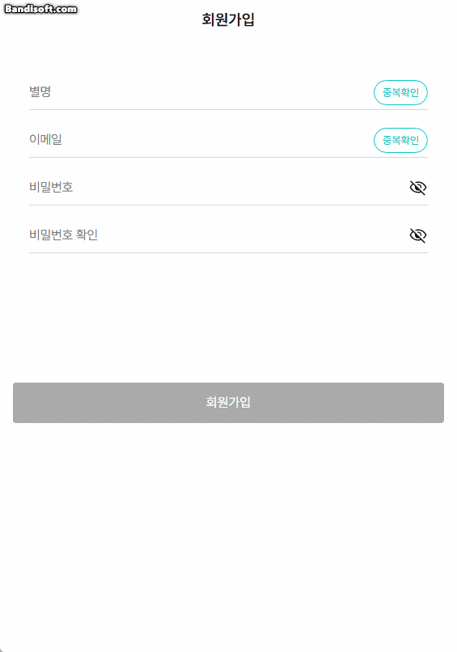
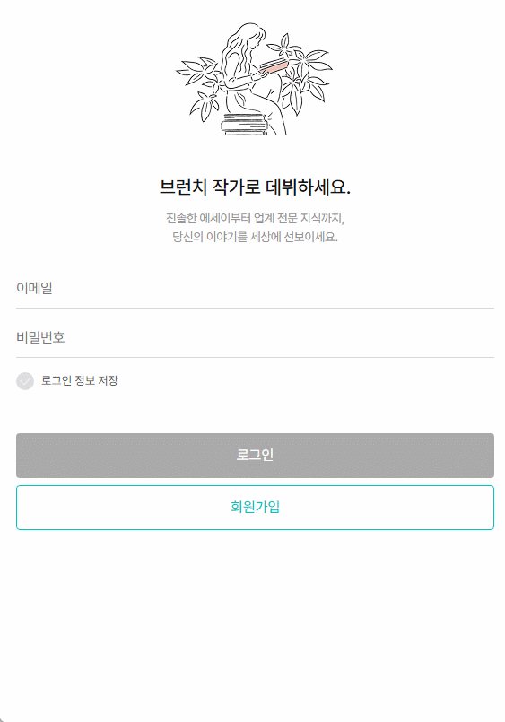
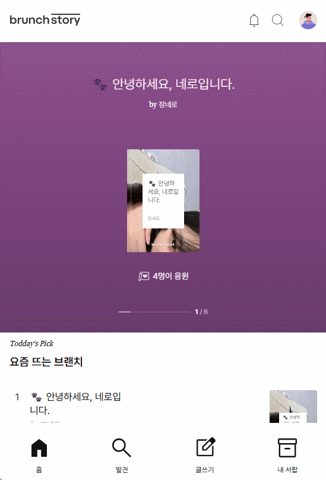
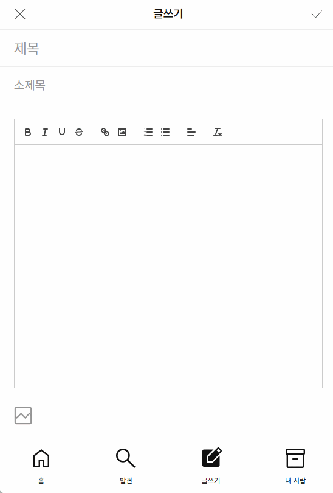
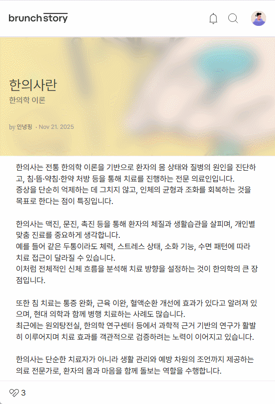
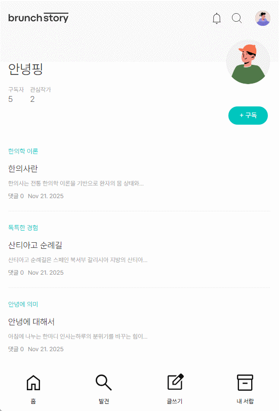
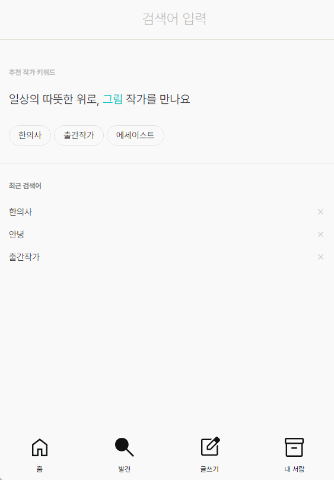
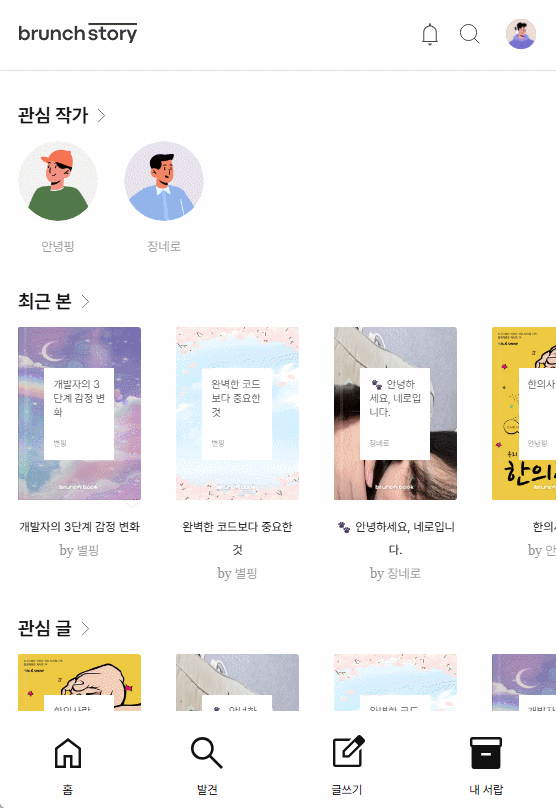

# 6조 : init

> **init: 모든 시작은 여기서부터**
> <br/>


### [♥배포주소♥](https://vanilla-06-init.netlify.app/)

<br/>
<hr/>

<br/>

## 🕒프로젝트 기간

> 2025.11.10 ~ 2025.11.24
> <br/>

<br/>

## 🧑‍🌾 팀원소개

|                                                                                                 |                                                                                              |                                                                                                |                                                                                             |
| :-----------------------------------------------------------------------------------------------------------------------------------: | :-----------------------------------------------------------------------------------------------------------------------------------: | :----------------------------------------------------------------------------------------------------------------------------------: | :-------------------------------------------------------------------------------------------------------------------------------: |
| 고은별 [](https://github.com/byeolscript) | 문혁진 [](https://github.com/moonhyukjin) | 장수정 [](https://github.com/BlueCrocus) | 조시연 [](https://github.com/s2iyeon) |
|                                                               팀장, PM                                                                |                                                                 발표                                                                  |                                                                  PL                                                                  |                                                               서기                                                                |
|                                               메인페이지, 로그인페이지, 회원가입페이지                                                |                                                       검색페이지, 글쓰기페이지                                                        |                                                            내서랍 페이지                                                             |                                                     상세페이지, 작가홈페이지                                                      |

<br/>

## ⚙️기술 스택

<div align="center">

| 분류             | 툴                                                                                                                                                                                                                                                                                                                                                                                                                  |
| ---------------- | ------------------------------------------------------------------------------------------------------------------------------------------------------------------------------------------------------------------------------------------------------------------------------------------------------------------------------------------------------------------------------------------------------------------- |
| **기술 스택**    |                                                                                                                                                                                                                                                                                                        |
| **UI/UX**        |                                                                                                                                                                                                                                                                                                                  |
| **개발 환경**    |                                                                                                                                                                                           |
| **커뮤니케이션** |     |
| **배포**         |                                                                                                                                                                                                                                                                                                             |

</div>

## 🖥️ 서비스 소개

### 🔐 회원가입 페이지

- 닉네임(이름) 중복 확인
  - 중복 아님 → 안내 문구(민트색): **"사용할 수 있는 별명입니다."**
  - 중복임 → 안내 문구(빨간색): **"중복된 별명입니다."**
- 이메일 형식 체크
- 이메일 중복 확인
  - 중복 아님 → 안내 문구(민트색): **"사용할 수 있는 이메일입니다."**
  - 중복임 → 안내 문구(빨간색): **"중복된 이메일입니다."**
- 비밀번호 표시 토글
  - 눈 아이콘 클릭 시 비밀번호 텍스트 표시/숨김 토글
- 비밀번호 규칙
  - 대소문자, 숫자 조합 8자 이상
- 조건값 일치시 회원가입 버튼 활성화 조건

<table >
<tr>
<td style="center">

</td>
</tr>
</table>

---

### 🔐 로그인 페이지

- 이메일 로그인 가능
- 회원가입은 각각의 유효성 검사에 맞게 입력
- 이메일 + 비밀번호가 모두 입력되면 로그인 버튼 활성화

<table >
<tr>
<td style="center">

</td>
</tr>
</table>

---

### 🏠 홈화면

- 좋아요가 많은순으로 최대 6개 비주얼영역 배치
- 신규글 10개 배치
- 구독자가 많은 TOP 4명 배치

<table >
<tr>
<td style="center">

</td>
</tr>
</table>

---

### ✍️ 글쓰기 페이지

- quill 에디터
- 표지 이미지 파일선택

<table >
<tr>
<td style="center">

</td>
</tr>
</table>

---

### 📄 상세 페이지

- 상단 비주얼
- 좋아요 버튼
- 작가 정보
- 구독 버튼
- 태그 연동

<table >
<tr>
<td style="center">

</td>
</tr>
</table>

---

### 📄 작가홈 페이지

- 구독 버튼
- 작가 정보
  - 구독자수
  - 관심작가수
- 해당 작가글 리스트

<table >
<tr>
<td style="center">

</td>
</tr>
</table>

---

### 🔍 검색 페이지

- 최근검색어
- 글 검색
- 작가 검색
- 하이라이트

<table >
<tr>
<td style="center">

</td>
</tr>
</table>

---

### 🗂️ 내서랍 페이지

- 관심 작가 리스트
- 최근 본글 리스트
- 관심 글 리스트
- 내 브런치 리스트

<table >
<tr>
<td style="center">

</td>
</tr>
</table>

---

<br/>

<br/>

## 🐞 트러블슈팅

<table>
<thead>
<tr>
<th style="width: 100px;">이름 👤</th>
<th>❗ 문제점</th>
<th>🛠️ 해결 사례</th>
</tr>
</thead>
<tbody>
<tr>
<td>고은별</td>
<td>처음 완성했던 중복확인 버튼이 적용이 되지 않아 ‘중복된 별명입니다’라는 문구가 적용되지 않음</td>
<td>CSS에서 해당 요소를 display: none으로 숨겨놓았고, 프로젝트 공통 CSS에서는 display: flex가 적용되도록 설정해 두었는데 ts파일에 적용하지 않아서 일부 추가 되지 않는 곳에 해당 Ts파일 코드에 classList.add()로 해당 클래스를 추가하여 해결.</td>
</tr>
<tr>
<td>문혁진</td>
<td>컨텐츠와 이미지를 업로드할 때 서버에 정상적으로 등록되지 않는 문제가 발생함</td>
<td>
엔드포인트 <code>/files</code>에 <code>multipart/form-data</code> 형태로 이미지를 먼저 업로드하여 서버에 경로를 저장한 후,<br>
해당 이미지 경로를 포함한 콘텐츠 데이터를 다시 POST 요청으로 전달하는 방식으로 문제 해결
</td>
</tr>
<tr>
<td>장수정</td>
<td>
<code>GET /bookmarks/user?target_id=17</code> 요청 사용 시, 서버에서 <code>target_id</code> 쿼리 파라미터를 활용한 DB 조회 로직에 문제가 있었거나<br>
Number/String 타입 변환 과정에서 오류가 발생하여 정상적인 응답을 받지 못한 상황
</td>
<td>
기존 <code>/bookmarks/{type}</code> 엔드포인트 대신, 로그인된 사용자 토큰을 기반으로 모든 북마크 데이터를 한 번에 조회하는 다른 경로를 사용하여 문제를 우회함.<br>
최종 적용 경로: <code>GET /users/${currentId}/bookmarks</code> (예: <code>GET /users/17/bookmarks</code>)
</td>
</tr>
<tr>
<td>조시연</td>
<td>
상세페이지와 작가 홈에서 API 요청 시 <code>userId</code>, <code>postId</code>와 다른 쿼리 파라미터를 사용하여 데이터 로딩 실패가 발생한 문제
</td>
<td>
실제 API 스펙과 페이지 URL 구조를 다시 확인하여 파라미터 키(<code>userId</code>, <code>postId</code>)를<br>
일치시키도록 수정한 뒤, 정상적으로 데이터 렌더링되는 것을 확인
</td>
</tr>
</tbody>
</table>

## 💪 챌린지

- 고은별
  - 회원가입 ts에서 eye icon을 토글 형식으로 하여 클릭시 텍스트와 password로 변경 되는 기능.
  - 로그인 중 상태 표시 & 중복 클릭 방지
    - 로그인 요청 동안 버튼 비활성화하여 중복 요청 방지
    - 버튼 텍스트를 “로그인 중…”으로 변경해서 진행 상태 표시
  - 비밀번호 보안 규칙 검사 (정규식 + 조건 체크)
    - “8자 이상 + 대문자 + 소문자 + 숫자 포함”이라는 구체적인 비밀번호 구현
    - 정규식 + 길이 체크를 조합해서 구현

- 문혁진
  - quill 에디터 활용및 이미지 파일을 등록해 표지이미지로 활용
  - 최근검색어를 로컬스토리지에 넣어 연동
  - 검색시 동일한 글씨는 하이라이트 표시

- 장수정
  - ‘내 브런치’ 상세 내용(부제) 20자 제한 구현
    - renderMyPost함수는 부제(item.extra.subTitle)의 길이를 체크하여 20자 초과 시 말줄임표(…)를 붙여 decs변수에 할당

- 조시연
  - 글쓰기 페이지는 썸네일 이미지 첨부가 필수이므로, 본문에 이미지가 없을 때 기본 이미지 대신 글쓰기 썸네일을 사용하도록 변경

<br/>

---

<br/>

## 회고

### 고은별

- **🟦 잘된 점**<br/>
  필수 항목의 기능 구현을 전부 해낸거 같음.

- **🟩 아쉬운 점**<br/>
  필수 항목 이외의 기능 구현을 시도해보지 못해서 아쉬움.

- **🟪 성장 경험**<br/>
  이번 팀 프로젝트를 하면서 협업에 대한 태도와 팀 이라는 것에 대해 다시 생각하게 되었고, 잊고 있던 코드들과 수업 내용들도 다시 복습하는 계기가 되었고, 모르는 부분은 찾아 보며 코드의 흐름을 좀 더 알게 된거 같다.

---

### 문혁진

- **🟦 잘된 점**<br/>
  팀원들의 열정과 집중 덕분에 자연스럽게 몰입하며 프로젝트를 진행할 수 있었다.  
  트러블 없이 협업 과정이 편안하게 흘러간 점이 좋았다.

- **🟩 아쉬운 점**<br/>
  API와 TypeScript를 처음 사용하다 보니,  
  구체적으로 세팅하고 정해진 형식에 맞춰 진행하지 못한 점이 아쉽다.

  초반에 구조와 코딩 패턴을 충분히 고민하지 못해 코드 일관성을 유지하는 데 시간이 더 필요했다.  
  다음 프로젝트에서는 초기 세팅과 구조 설계에 중점을 두어 통일감있게 작업을 노력해야겠다.

- **🟪 성장 경험**<br/>
  서버에서 제공받은 데이터를 가공하며 전반적인 로직 흐름을 이해하고 컴포넌트 간 상태 전달과 API 연동 과정을 실제로 적용해 볼 수 있었다.

  하나의 결과물을 위해 팀 공통 규칙을 정하고, 데일리 스크럼으로 진행 상황을 공유하며, 트러블슈팅과 의견 조율 과정을 경험했다. 이 과정에서 협업의 중요성과 추후 실무에서의 문제 해결 방식을 다시 생각해보는 시간이 되었다.

---

### 장수정

- **🟦 잘된 점**<br/>
  팀원들을 정말 잘 만났다.  
  누구 하나 빠짐없이 서로를 챙기고 도와주는 분위기 덕분에, 어려웠던 API 작업도 덜 막막하게 느껴졌다.  
  개인 사정으로 저녁 시간에 참여하지 못하는 날이 많았는데, 팀원들은 항상 진행 상황을 공유해주고 응원해 주셨다.

- **🟩 아쉬운 점**<br/>
  처음 접한 API 때문에 예상보다 난관이 많았고, 일정 때문에 충분히 함께하지 못한 시간이 있었다.  
  내가 맡은 부분을 충분히 해내지 못한 것 같아 아쉽다.

- **🟪 성장 경험**<br/>
  내가 접한 언어(HTML, TypeScript)는 독학으로 구버전 느낌으로 배우게 되었는데,  
  수업 중 실습을 통해 어느 정도 최신 버전으로 업데이트했다 생각했지만,  
  이번 프로젝트를 통해 최신 버전으로 완전히 익힌 느낌이다.

---

### 조시연

- **🟦 잘된 점**<br/>
  이번 프로젝트는 전체적으로 큰 문제 없이 순조롭게 진행되었다.

  상세페이지와 작가 홈처럼 데이터 연동이 많은 기능들도 예상보다 안정적으로 구현되었고,  
  팀원들과의 의사소통도 원활하게 이루어져 전체 일정에 차질이 없었다.

  각자 맡은 기능을 명확하게 완성했다는 점에서 뿌듯했고,  
  처음 참여한 팀 프로젝트였음에도 협업 과정이 자연스럽고 편안하게 흘러갔다는 점이 좋았다.

- **🟩 아쉬운 점**<br/>
  UI(CSS) 부분에서는 아쉬움이 남는다.

  시안을 똑같이 구현한다는 목표였지만, 기능 구현에 더 집중하다 보니  
  디테일 조정이나 완성도 높은 스타일링까지 챙기지 못했다.

  큰 문제는 없었지만, 조금만 더 시간을 썼다면 더 깔끔한 UI를 만들 수 있었을 것 같다.  
  다음 프로젝트에서는 스타일링 완성도까지 충분히 챙기고 싶다.

- **🟪 성장 경험**<br/>
  이번 프로젝트는 나에게 의미 있는 성장 경험이었다.

  팀 프로젝트가 처음이라 잘못 따라가거나 실수를 해서 팀에 민폐가 될까 걱정이 컸지만,  
  막상 프로젝트가 시작되자 팀원들이 서로 많이 도와주고 알려주는 분위기였다.

  그 덕분에 처음의 두려움은 점점 사라졌고,  
  오히려 함께 문제를 해결하고 기능을 만들어가는 과정이 즐겁게 느껴졌다.

  협업을 통해 “혼자 하는 개발보다 함께 만드는 개발이 더 빠르고, 더 재미있고, 더 많이 배울 수 있다”는 것을 실감했다.  
  이번 경험은 다음 프로젝트에서도 큰 자신감을 줄 것 같다.

<br/>

---

<br/>

## 📌 스크럼/회의록

<table cellpadding="5" cellspacing="0">
<caption><b>2025년 11월</b></caption>
<tr>
<th>일</th><th>월</th><th>화</th><th>수</th><th>목</th><th>금</th><th>토</th>
</tr>

<tr>
<td></td><td></td><td></td><td></td><td></td><td></td>
<td>1</td>
</tr>

<tr>
<td>2</td><td>3</td><td>4</td><td>5</td><td>6</td><td>7</td><td>8</td>
</tr>

<tr>
<td>9</td>
<td><a href="https://www.notion.so/2025-11-10-2a773873401a81ed8c2adb907ff5c3bd">10</a></td>
<td><a href="https://www.notion.so/2025-11-11-2a773873401a81bc9360eae0b5551cf9">11</a></td>
<td><a href="https://www.notion.so/2025-11-12-2a773873401a81c4a881c23c425b0cd2">12</a></td>
<td><a href="https://www.notion.so/2025-11-13-2ad73873401a80c2b7b1e1bcf4f3e627">13</a></td>
<td><a href="https://www.notion.so/2025-11-14-2ad73873401a80db979ac9091d634dd5">14</a></td>
<td>15</td>
</tr>

<tr>
<td>16</td>
<td><a href="https://www.notion.so/2025-11-17-2ad73873401a808f993de4c9cfc95b35">17</a></td>
<td><a href="https://www.notion.so/2025-11-18-2b073873401a808ba2bec117bd779db0">18</a></td>
<td><a href="https://www.notion.so/2025-11-19-2b073873401a8062a39de0a398502112">19</a></td>
<td><a href="https://www.notion.so/2025-11-20-2b173873401a808f96f7d2a7c3eea285">20</a></td>
<td><a href="https://www.notion.so/2025-11-21-2b273873401a80ab8971d7db41a31e4a">21</a></td>
<td>22</td>
</tr>

<tr>
<td>23</td>
<td>24</td><td>25</td><td>26</td><td>27</td><td>28</td><td>29</td>
</tr>
<tr><td>30</td></tr>
</table>

</td>
<td style="width: 50px;"></td> <!-- 간격 -->
<td>
---

<br/>

## 📁 프로젝트 폴더 구조

```
📦 project-root
├── 🌐 public/
│   ├── 🖼️ icons/
│   └── 🖼️ images/
│
├── 🧩 src/
│   ├── 🎨 assets/
│   │   ├── 🖼️ icons/
│   │   └── 🖼️ images/
│   │
│   ├── 🧱 components/
│   │
│   ├── 📄 pages/
│   │   ├── 🔐 auth/
│   │   ├── ✍️ author/
│   │   ├── 🔍 discover/
│   │   ├── 📥 drawer/
│   │   └── 📝 posts/
│   │
│   ├── 🎛️ styles/
│   ├── 🧾 types/
│   └── 🛠️ utils/
│
├── 🧩 index.html
├── 📦 package.json
└── ⚙️ 기타 설정 파일들


```
